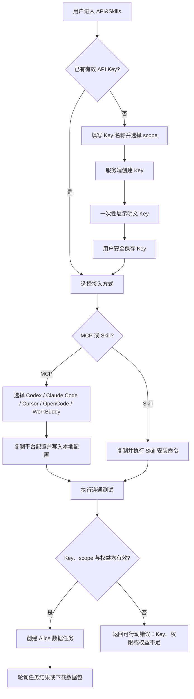
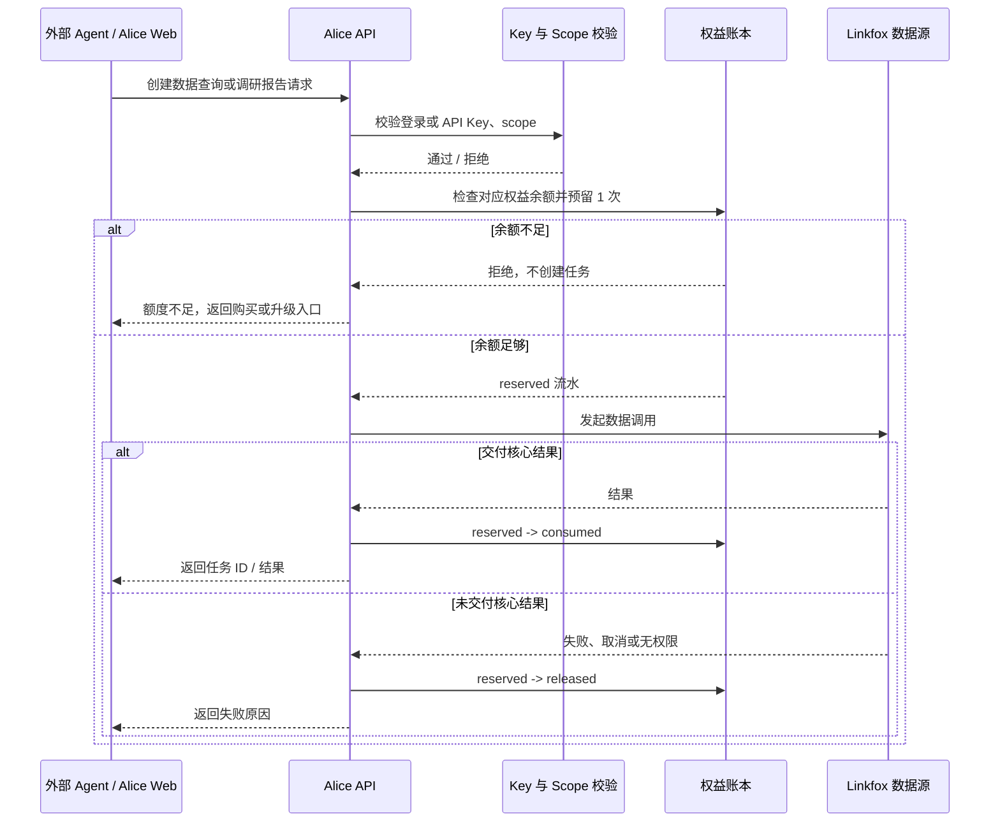
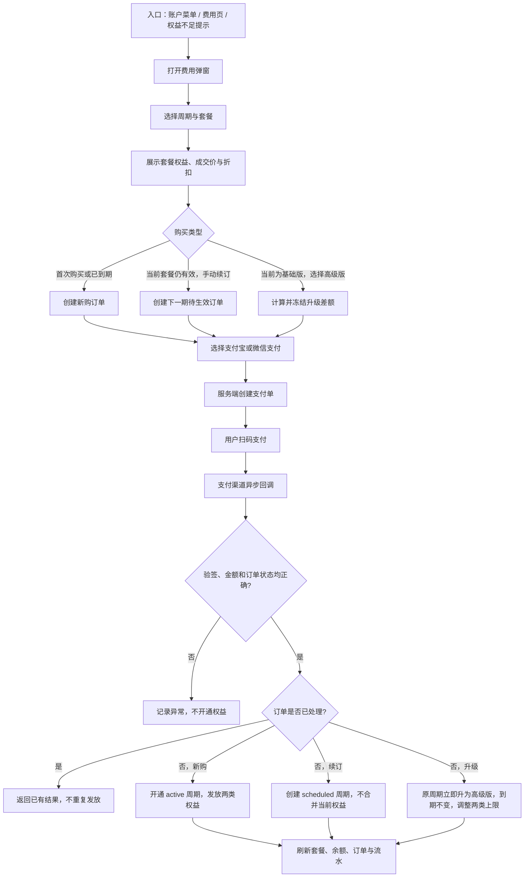

# Alice API&Skills、费用与个人中心一期 PRD

**版本**：v1.0
**状态**：待研发评审
**范围**：API&Skills、费用与升级套餐、个人中心、问题反馈

## 1. 摘要

Alice 一期需要同时完成两件事：

1. 让用户能把 Alice 的数据能力安全地接入外部 Agent 和开发工具。
2. 让用户能购买、理解并管理自己获得的数据查询与调研报告权益。

用户侧不展示 Linkfox Agent 的积分、预扣或补扣。Alice 对用户承诺的是两类明确结果权益：**数据查询次数**与**调研报告次数**；无论用户在 Alice 内使用，还是经 API/MCP 调用，均扣减对应权益。Linkfox 的实际消耗只用于内部成本监控与套餐调价。

## 2. 目标与非目标

### 2.1 目标

- 用户可创建、复制、撤销 API Key，并完成 MCP 或 Skill 安装。
- 用户可购买、续订、升级套餐，并查看两类权益余额、流水与订单记录。
- 系统以服务端支付回调为准开通套餐，以不可变权益流水为准扣减与返还。
- 用户可维护基础资料，并提交问题反馈；帮助文档从菜单直接跳转外部链接。
- 后台可配置套餐、周期、价格、折扣与两类权益，历史订单不受后续配置影响。

### 2.2 非目标

- 不向用户按 Linkfox 积分、预扣积分或最终实际成本收费。
- 不做自动续费、自动代扣、余额钱包、加油包、积分转赠或跨账户共享权益。
- 不支持当前周期降级；退款仅支持运营人工处理。
- 不建设 API/MCP 应用市场，不支持任意自定义 MCP 工具。
- 不在一期内实现帮助文档内容管理系统。

## 3. 核心产品决策

| 决策 | 规则 | 原因 |
| --- | --- | --- |
| 用户侧计费单位 | 数据查询次数、调研报告次数，独立余额、独立扣减 | 用户能理解并核对实际交付结果 |
| Web 与外部调用 | 共用同一份用户权益；流水记录来源为 Web、API 或 MCP | 防止同一能力出现两套可被套利的额度 |
| 周期锚点 | 支付成功时刻起连续一个周期；月付为连续一个月，不按自然月 | 与 Linkfox 现有按购买时间生效的习惯一致，用户也更容易理解 |
| 到期 | 未使用权益失效，不结转、不退款 | 防止跨周期成本失控 |
| 续订 | 手动续订；有当前周期时购买下一期，创建待生效周期 | 不要求用户自动扣款，也不合并两期权益 |
| 升级 | 仅基础版可即时升至高级版；到期日不变，按剩余时长计算差额 | 解决重度用户当期权益不足 |
| 定价基准 | 套餐以 Linkfox 成本、40% 风险缓冲、40% 毛利反推 | 在无法获取任务级最终成本时仍可控风险 |

## 4. 用户与场景

| 用户 | 要完成的事 | 一期结果 |
| --- | --- | --- |
| Alice 使用者 | 在产品内查询数据、产出调研报告 | 看清两类剩余次数和到期时间，按结果权益使用 |
| 开发者 / Agent 使用者 | 让 Codex、Claude Code、Cursor、OpenCode 或 WorkBuddy 调用 Alice | 创建 Key，复制对应 MCP 配置或安装 Skill，并完成一次连通测试 |
| 付费用户 | 购买、续订或升级 | 选择套餐、支付、服务端开通并获得可审计权益 |
| 客服 / 运营 | 定位账户、处理反馈与退款 | 通过 UUID、订单和权益流水定位；退款走人工工作流 |

## 5. 模块一：API&Skills

### 5.1 价值与信息架构

API&Skills 不是单纯的 API Key 页面，而是帮助外部 Agent 接入 Alice Data Fetcher 的入口。页面按用户完成接入的顺序组织：

1. API Key：创建、查看状态、撤销。
2. MCP：按平台展示可复制配置。
3. Skill：提供安装命令与适用平台。
4. OpenAPI：跳转 API 文档和 OpenAPI JSON。
5. 测试：用一次真实或沙箱请求确认连通性、权限与结果格式。

支持的平台：Codex、Claude Code、Cursor、OpenCode、WorkBuddy。

### 5.2 API Key 规则

- 创建时填写名称，选择 scope；一期默认可选 `bulk.run`、`run.read`、`bundle.download`。
- Key 明文只在创建成功弹窗展示一次；之后仅显示前缀、尾号、创建时间、最近使用时间、scope 与状态。
- Key 状态为 `active` 或 `revoked`；撤销后立即拒绝新请求，历史审计保留。
- 外部 API / MCP 请求必须携带有效 Key；Web 请求使用登录会话。两类请求均需先校验权限、再校验对应权益余额，任一失败均不得调用外部数据源。

### 5.3 MCP 与 Skill 能力边界

一期开放以下数据型工具，避免暴露泛聊天接口：

| 工具 | 作用 | 需要 scope |
| --- | --- | --- |
| `alice_create_data_task` | 创建结构化数据查询或调研报告任务 | `bulk.run` |
| `alice_get_data_task` | 查询任务状态与结构化结果 | `run.read` |
| `alice_download_data_bundle` | 下载数据、报告或证据包 | `bundle.download` |

Skill 只负责教 Agent：何时调用 Alice、如何把自然语言需求转成结构化请求、如何检查市场/时间范围/字段/来源是否缺失；实际鉴权与计费永远由服务端完成。

`alice_create_data_task` 的一期请求至少包含 `task_type`（`data_query` 或 `research_report`）、`query`、`market`、`time_range`、`fields` 与 `output_format`。服务端依据 `task_type` 选择并预留相应权益，不能由客户端指定扣减类别。

### 5.4 API&Skills 接入流程



### 5.5 任务调用与权益校验流程



### 5.6 验收标准

- 用户可在 API&Skills 页面完成 Key 创建、一次性复制、撤销和状态查看。
- 五个目标平台至少各有一份可复制的 MCP 或 Skill 配置。
- 任一外部调用均通过 API Key、scope 与权益三层校验。
- 任务结果、失败原因、下载行为可追溯到用户、Key、任务与权益流水。

## 6. 模块二：费用与升级套餐

### 6.1 用户可见套餐与权益

一期用户只看到确定权益，不显示积分或“约可”。月付目录价如下：

| 套餐 | 月付目录价 | 数据查询 | 调研报告 | 其他权益 |
| --- | ---: | ---: | ---: | --- |
| 基础版 | ¥199 | 80 次 | 8 次 | 单账号单设备在线、Alice Skills、导出报告、上传附件、定时任务 |
| 高级版 | ¥549 | 220 次 | 22 次 | 同基础版，更适合高频使用 |

周付、月付、年付均由后台套餐配置返回。折扣通过 `目录价`、`成交价`、`活动标识` 配置；页面可显示折扣 Tag、划线价与应付金额。折扣只影响新建订单，订单创建时将价格与权益写入快照，之后不可改写。

### 6.2 定价推算：费用从何而来

#### 6.2.1 成本输入

以 Linkfox 基础包作为保守成本基线：

| 输入 | 数值 | 说明 |
| --- | ---: | --- |
| Linkfox 基础包 | ¥299 / 21,000 积分 | 采用当前可观察的基础包，不以促销价做长期成本基准 |
| 单积分成本 | ¥0.014238 | `299 ÷ 21,000` |
| 数据查询估算成本 | 60 积分 / 次 | `21,000 ÷ 350` 反推的基准值 |
| 调研报告估算成本 | 145 积分 / 次 | `21,000 ÷ 145` 反推的基准值 |
| 报告成本占比 | 20% | 用于校验套餐组合是否符合“高频查询 + 少量深度报告” |
| 风险缓冲 | 40% | 覆盖实际用量波动、预扣/补扣差异及不可归因成本 |
| 目标毛利率 | 40% | 互联网产品一期目标毛利 |

由此得到单位成本：

```text
数据查询单位成本 = 60 × (299 ÷ 21,000) = ¥0.854
调研报告单位成本 = 145 × (299 ÷ 21,000) = ¥2.065

原始成本 = 数据查询次数 × ¥0.854 + 调研报告次数 × ¥2.065
含缓冲成本 = 原始成本 × 1.40
建议售价 = 含缓冲成本 ÷ (1 - 40%)
```

#### 6.2.2 套餐复算

| 套餐 | 原始成本 | 含 40% 缓冲成本 | 40% 毛利反推售价 | 目录价 | 结论 |
| --- | ---: | ---: | ---: | ---: | --- |
| 基础版：80 查询 + 8 报告 | `80×0.854 + 8×2.065 = ¥84.84` | ¥118.77 | ¥197.95 | ¥199 | 达标 |
| 高级版：220 查询 + 22 报告 | `220×0.854 + 22×2.065 = ¥233.31` | ¥326.63 | ¥544.39 | ¥549 | 达标 |

报告成本在基础版与高级版原始成本中的占比分别约为 16% 与 19%，与“约 20% 预算留给少量深度调研报告”的组合目标一致；这不是向用户承诺的成本比例，也不会限制用户在剩余额度内使用任一权益。

这是一条**内部定价模型**，不是逐任务结算公式。Linkfox 未提供任务级预扣/最终消耗时，Alice 不会把成本波动转嫁给用户；运营每天导入 Linkfox 总消耗，按套餐和任务类型观察真实毛利，并据此调整后续新订单的套餐配置。

### 6.3 购买、续订与升级流程



### 6.4 周期、续订与升级规则

- 支付成功后开始新周期；默认月付有效期为支付成功时刻起连续一个月，不按自然月。
- 同一用户最多一个 `active` 当前周期和一个 `scheduled` 待生效周期。
- 提前续订不会合并、叠加或提前发放下一期权益；当前周期到期后才启用 `scheduled` 周期。
- 基础版即时升级高级版：到期时间不变；升级差额按剩余有效秒数抵扣已付基础版价值，金额按分向上取整，写入订单快照后不重算。
- 升级后，两类总权益分别调整为高级版当期上限；已消耗与已预留次数保留，余额重新计算。
- 不支持当前周期降级；不提供自动续费。人工退款需关闭对应权益并保留完整审计。

### 6.5 费用页要求

- 账户菜单顶部展示当前套餐、数据查询余额、调研报告余额与升级入口。
- 「费用」弹窗固定高度；包含套餐与账单、订单记录、套餐选择三个视图。
- 套餐与账单：展示当前套餐、到期时间、两类独立余额和可垂直滚动的权益明细；每次懒加载 10 条。
- 权益明细字段：时间、权益、事项、类型、变动、该权益余额；不展示合并总余额。
- 套餐选择：支持周付、月付、年付；年付折扣以独立 Tag 展示；选择卡片具备 hover 与 selected 状态；底部固定显示应付金额和支付按钮。
- 支付弹窗默认支付宝，允许切换微信支付；仅展示支付方式、二维码与扫码提示。支付成功以服务端查询结果为准。

### 6.6 权益账本与异常

| 场景 | 系统行为 |
| --- | --- |
| 创建可计费请求 | 对应权益先创建 `reserved` 流水；余额不足则不调用数据源 |
| 交付核心结果 | `reserved -> consumed` |
| 未交付核心结果而失败、取消或数据源不可用 | `reserved -> released`，返还对应权益 |
| 周期到期 | 未使用余额记为 `expired`，不可结转 |
| 重复支付回调 | 使用订单号、渠道交易号和幂等键处理，最多开通/发放一次 |
| 支付成功但开通失败 | 保留 `paid` 事实，触发重试和告警；不得要求用户重复支付 |

## 7. 模块三：个人中心

### 7.1 功能范围

个人中心是账户资料的唯一编辑入口；费用独立为设置中的一级菜单。

- 展示头像、名称、邮箱、手机号、账户 UUID。
- 头像支持更换头像背景色；名称支持行内编辑并即时保存。
- 邮箱和手机号一期只展示，不在本页修改；变更需走现有身份验证流程后续实现。
- UUID 支持复制，用于问题反馈和技术支持定位；复制结果以 Toast 展示，不出现在页面内容区。
- 支持从个人中心发起退出登录二次确认。

### 7.2 验收标准

- 名称修改后，侧栏、账户菜单和个人中心同步显示。
- 邮箱、手机号、UUID 属于同一资料分组，信息层级清晰。
- 头像颜色可选且刷新后保持；UUID 不可编辑。

## 8. 模块四：问题反馈

### 8.1 功能范围

- 账户菜单保留「帮助文档」和「问题反馈」：帮助文档直接打开外部链接；问题反馈打开 Alice 内弹窗。
- 反馈弹窗只保留「反馈内容」富文本编辑器与提交操作，不增加反馈类型、二级分类或冗余说明。
- 提交时自动附带用户 UUID、用户 ID、当前页面、客户端版本、提交时间；用户无需手动填写这些定位信息。
- 提交成功使用 Arco Result 风格的简洁结果状态；失败保留输入内容并提示重试。

### 8.2 流程


## 9. 数据与安全要求

| 对象 | 核心字段 / 要求 |
| --- | --- |
| `api_keys` | user_id、name、prefix、last4、scope、status、created_at、last_used_at；仅保存密钥哈希 |
| `orders` | 订单类型、新旧套餐快照、成交价、折扣、支付渠道、状态、幂等键 |
| `subscription_cycles` | user_id、plan_snapshot、status、starts_at、ends_at；同一用户最多一个 active 与一个 scheduled |
| `entitlement_ledger` | cycle_id、user_id、source、entitlement_type、task_id、delta、status、idempotency_key；不可变 |
| `feedback` | user_id、uuid、content、page_path、client_version、status、created_at |
| `linkfox_daily_costs` | 日期、账号范围、积分消耗、原始凭证引用、导入时间；仅内部可见 |

- API Key 明文不得二次展示、不得记录到日志、不得写入前端持久化存储。
- 支付回调必须验证签名、金额、商户订单号、商户身份和支付状态。
- 权益余额必须由账本回算或事务更新，不允许仅修改汇总数。
- 价格、折扣、权益和升级差额均以订单快照为准，后台后续配置变更不得影响已支付订单。

## 10. 指标

| 类型 | 指标 |
| --- | --- |
| 接入 | Key 创建成功率、MCP/Skill 配置复制率、首次连通测试成功率 |
| 付费 | 套餐选择到支付创建转化率、支付成功开通率、升级率、手动续订率 |
| 使用 | 数据查询与调研报告的独立使用率、权益不足率、失败返还率 |
| 成本 | 各套餐实际毛利率、日 Linkfox 成本与预算偏差、缓冲覆盖率 |
| 支持 | 反馈提交成功率、反馈首次响应时长、按 UUID 定位成功率 |

## 11. 上线验收清单

- [ ] API Key、MCP、Skill、OpenAPI 与测试入口均可访问；无 Key、无 scope、权益不足错误可区分。
- [ ] Web、API、MCP 的同类请求均扣减同一类权益，并产生可追溯流水。
- [ ] 支付宝与微信支付的成功回调可幂等开通；重复回调不重复发放权益。
- [ ] 购买、提前续订、基础版升级高级版、到期、支付异常均符合本 PRD 状态规则。
- [ ] 费用页两类权益独立可见，明细列表按 10 条懒加载，订单记录可查询。
- [ ] 个人中心可编辑名称和头像背景色，邮箱/手机号/UUID 可见，UUID 可复制。
- [ ] 帮助文档为外跳，问题反馈仅保留富文本内容输入并自动携带定位信息。
- [ ] 每日 Linkfox 总消耗导入仅供内部成本监控，用户界面不出现积分、预扣、补扣或“约可”。
